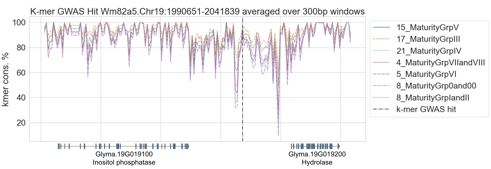
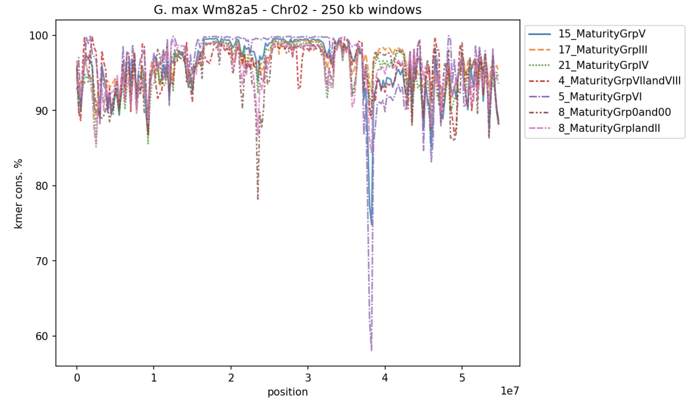

## snakemake example usage
### subset
```
snakemake --tibanna --use-conda --snakefile subsetSnakefile \
    --tibanna-config root_ebs_size=32 log_bucket=salk-tm-logs \
    --default-remote-prefix salk-tm-dev/heidi/data1/hechen/MUsoyGenomes/pankmer \
    --configfile config/testSubsetPhased.json -p -j 1
```

### indexAndCharacterize
```
fList=Gcan_PI583945.a01.softmasked.fasta.gz,Gcyr_PI446944.a01.softmasked.fasta.gz,[...]

snakemake --tibanna --use-conda --snakefile indexAndCharacterizeSnakefile \
    --tibanna-config root_ebs_size=32 log_bucket=salk-tm-logs \
    --default-resources disk_mb=500000 mem_mb=1000000 \
    --default-remote-prefix salk-tm-dev/heidi/data1/hechen/MUsoyGenomes \
    --config \
        genomes=${fList} \
        outdir=pankmer/137panGlycine_k25_241002 \
        outputID=137panGlycine_k25 \
        k=25 \
        threads=128 \
        rounds=1 \
    -p -j 5 -k -n &>> logs/indexAndCharact137panGlycinek25.json

```

### anchorRegion
```
snakemake --tibanna --use-conda --snakefile anchorRegionSnakefile \
    --tibanna-config root_ebs_size=32 log_bucket=salk-tm-logs \
    --default-remote-prefix salk-tm-dev/heidi/data1/hechen/MUsoyGenomes \
    --default-resources disk_mb=100000 mem_mb=128000 \
    --configfile config/anchorMaturityGroups.json -p -j 100 &>> logs/anchorMatGroupsWm82a5
```

## example visualization

<details> 
	<summary><code>getKmerConsSignalForSubRegion.sh</code></summary> 

	#!/bin/bash 
	set -beEuo pipefail
	
	# getKmerConsSignalForSubRegion.sh ${coordinates}
	
	coords=$1
	chrom=$(echo $coords | cut -d":" -f1)
	runID=241002
	
	windowSize=300
	windowSize1=50
	convertGenomePositionFormatToBEDformat.sh ${coords} | tail -n 1 > ${coords}.bed
	bedtools makewindows -b ${coords}.bed -w $windowSize | sort -k1,1 -k2,2n > ${coords}_${windowSize}bpWindows.bed
	bedtools makewindows -b ${coords}.bed -w $windowSize1 | sort -k1,1 -k2,2n > ${coords}_${windowSize1}bpWindows.bed
	
	indexesToQuery="15_MaturityGrpV_index-ANCHOREDTO-Gmax_Wm82a5softmasked_241002 17_MaturityGrpIII_index-ANCHOREDTO-Gmax_Wm82a5softmasked_241002 21_MaturityGrpIV_index-ANCHOREDTO-Gmax_Wm82a5softmasked_241002 4_MaturityGrpVIIandVIII_index-ANCHOREDTO-Gmax_Wm82a5softmasked_241002 5_MaturityGrpVI_index-ANCHOREDTO-Gmax_Wm82a5softmasked_241002 8_MaturityGrp0and00_index-ANCHOREDTO-Gmax_Wm82a5softmasked_241002 8_MaturityGrpIandII_index-ANCHOREDTO-Gmax_Wm82a5softmasked_241002"
	
	outfile=combinedRawSignal_${coords}.tsv
	outfileAveraged1=combinedRawSignal_${coords}_avgdOver${windowSize1}bpWindows.tsv
	outfileAveraged=combinedRawSignal_${coords}_avgdOver${windowSize}bpWindows.tsv
	
	rm -f $outfile
	rm -f $outfileAveraged1
	rm -f $outfileAveraged
	
	for i in $indexesToQuery; do
		id=$(echo $i | cut -d"_" -f1-2)
		intersectBed -a ${i}/${chrom}_${runID}.bdg -b ${coords}.bed | awk -v name=$id -F"\t" 'OFS="\t" {print $1, $2+1, $4, name "\n" $1, $3, $4, name}' >> $outfile
	
		intersectBed -wo -a ${i}/${chrom}_${runID}.bdg -b ${coords}_${windowSize}bpWindows.bed | awk -F"\t" 'OFS="\t" { print $5, $6, $7-1, $8, $4 * $8 }' | sort -k1,1 -k2,2n | mergeBed -i stdin -c 4,5 -o distinct,sum | awk -F"\t" -v name=$id 'OFS="\t" { print $1, $2, $5/($3-$2+1), name }' >> ${outfileAveraged}
	
		intersectBed -wo -a ${i}/${chrom}_${runID}.bdg -b ${coords}_${windowSize1}bpWindows.bed | awk -F"\t" 'OFS="\t" { print $5, $6, $7-1, $8, $4 * $8 }' | sort -k1,1 -k2,2n | mergeBed -i stdin -c 4,5 -o distinct,sum | awk -F"\t" -v name=$id 'OFS="\t" { print $1, $2, $5/($3-$2+1), name }' >> ${outfileAveraged1}
	
	done

</details>

<details> 
	<summary><code>getCombinedRawSignalForRegion.sh</code></summary> 

	#!/bin/bash 
	set -beEuo pipefail
	
	# getCombinedRawSignalForRegion.sh ${coordinates}
	
	coords=$1
	chrom=$(echo $coords | cut -d":" -f1)
	runID=241002
	
	convertGenomePositionFormatToBEDformat.sh ${coords} | tail -n 1 > ${coords}.bed
	
	indexesToQuery="15_MaturityGrpV_index-ANCHOREDTO-Gmax_Wm82a5softmasked_241002 17_MaturityGrpIII_index-ANCHOREDTO-Gmax_Wm82a5softmasked_241002 21_MaturityGrpIV_index-ANCHOREDTO-Gmax_Wm82a5softmasked_241002 4_MaturityGrpVIIandVIII_index-ANCHOREDTO-Gmax_Wm82a5softmasked_241002 5_MaturityGrpVI_index-ANCHOREDTO-Gmax_Wm82a5softmasked_241002 8_MaturityGrp0and00_index-ANCHOREDTO-Gmax_Wm82a5softmasked_241002 8_MaturityGrpIandII_index-ANCHOREDTO-Gmax_Wm82a5softmasked_241002"
	
	outfile=combinedRawSignal_${coords}.tsv
	
	rm -f $outfile
	
	for i in $indexesToQuery; do
		id=$(echo $i | cut -d"_" -f1-2)
		intersectBed -a ${i}/${chrom}_${runID}.bdg -b ${coords}.bed | awk -v name=$id -F"\t" 'OFS="\t" {print $1, $2+1, $4, name "\n" $1, $3, $4, name}' >> $outfile
	done

</details>

<details> 
	<summary><code>plotRegionGtracks.sh</code></summary> 
	
	#!/bin/bash
	set -beEuo pipefail
	
	chromSizeFile=/data1/hechen/MUsoyGenomes/assemblies/nearlyGaplessRefAssemblies/Williams82_genome/Wm82.a5.refAssembly.chrom.sizes
	
	refGenes=/data1/hechen/MUsoyGenomes/assemblies/nearlyGaplessRefAssemblies/Williams82_genome/Wm82.a5.genes.bed12.gz
	
	# outroot=plotsForInclusiveSubsets
	
	inroot1=8_MaturityGrp0and00_index-ANCHOREDTO-Gmax_Wm82a5softmasked_241002
	inroot2=8_MaturityGrpIandII_index-ANCHOREDTO-Gmax_Wm82a5softmasked_241002
	inroot3=17_MaturityGrpIII_index-ANCHOREDTO-Gmax_Wm82a5softmasked_241002
	inroot4=21_MaturityGrpIV_index-ANCHOREDTO-Gmax_Wm82a5softmasked_241002
	inroot5=15_MaturityGrpV_index-ANCHOREDTO-Gmax_Wm82a5softmasked_241002
	inroot6=5_MaturityGrpVI_index-ANCHOREDTO-Gmax_Wm82a5softmasked_241002
	inroot7=4_MaturityGrpVIIandVIII_index-ANCHOREDTO-Gmax_Wm82a5softmasked_241002
	runID=241002
	
	coords=$1
	chrom=$(echo $coords | cut -d":" -f1)
	chromSize=$(grep $chrom $chromSizeFile | cut -f2)
	echo $chrom $chromSize
	
	bedgraph1=${inroot1}/${chrom}_${runID}.bw
	bedgraph2=${inroot2}/${chrom}_${runID}.bw
	bedgraph3=${inroot3}/${chrom}_${runID}.bw
	bedgraph4=${inroot4}/${chrom}_${runID}.bw
	bedgraph5=${inroot5}/${chrom}_${runID}.bw
	bedgraph6=${inroot6}/${chrom}_${runID}.bw
	bedgraph7=${inroot7}/${chrom}_${runID}.bw
	
	gtracks --genes ${refGenes} \
		--coord-regex '[\s\S]+:[0-9]+-[0-9]+$' ${coords} \
		${bedgraph1} \
		${bedgraph2} \
		${bedgraph3} \
		${bedgraph4} \
		${bedgraph5} \
		${bedgraph6} \
		${bedgraph7} \
		${coords}.png --plot-type "line:1" --gene-rows 3 --overlay --max 100 

</details>



